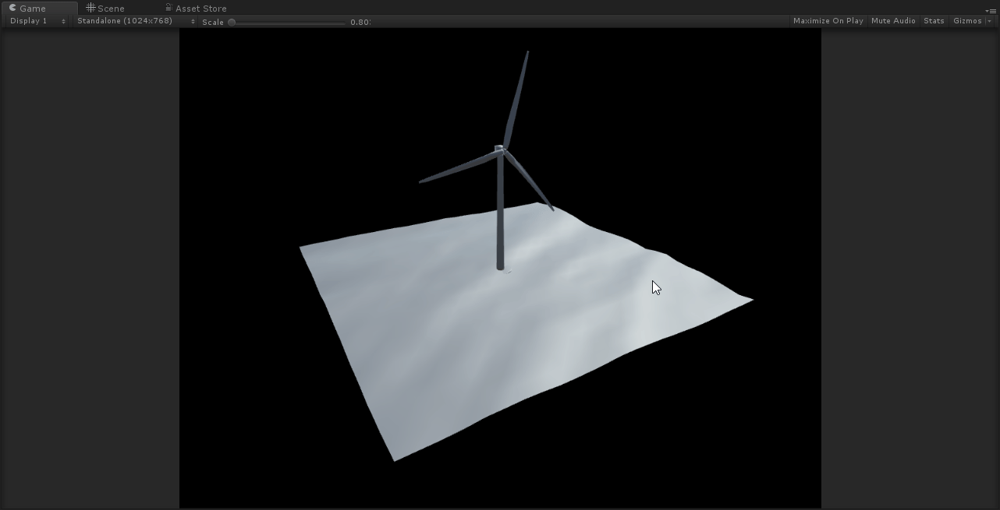

# UnityVTK
+ 2018 09 21
+ Prototype developed by Imgyu Kim
+ On going project...

## Dependency
+ Unity 2018.2.2
+ Kitware ActiViz OpenSource Edition 5.8.0
    + https://www.kitware.eu/product/activiz
+ Double sided shader
    + https://assetstore.unity.com/packages/vfx/shaders/double-sided-shaders-23087

## Application
+ Main application of the project is to visualize Floating Wind Turbine System that came from FAST v8.
+ FAST would generate all parts of Floating Wind Turbine system as VTP format.
+ This project can read them and visualize applying double sided shader (customized).